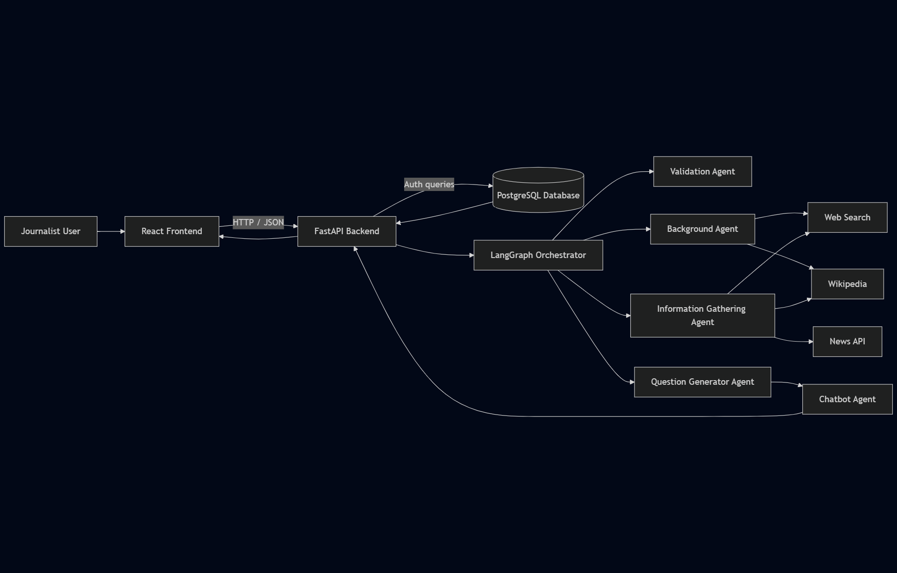

# Information Gatherer AI System

## Problem Statement

Journalists often work under tight deadlines and need to quickly gather accurate background information on public figures, understand recent developments related to them, and craft clear, relevant interview questions, which requires searching across news archives, press releases, public statements, research reports, and prior interviews. Doing this manually is time-consuming and can result in missing important context or producing poorly aligned questions. A web-search agent can streamline this process by summarizing a subject’s background, highlighting recent events, controversies, or achievements, generating well-structured and tailored interview questions, and suggesting follow-up questions when responses are vague or incomplete.


## Approach Used

The approach I used to solve this problem is to create a multi-agent solution comprising 4 different agents with each performing a particular task. They're as follows:
- Validator Agent
- Background Search Agent
- Information Gatherer Agent
- Question Generator Agent.

The Validator agent will first receive the name of the person that's going to be interviewed and the topic they're going to be interviewed on. Based on the information presented, it makes a web-search to identify the person and presents the details back to the user. The user can either confirm if the person's correct or provide additional details on that person to narrow them down.

The Background Search agent will search about the person on search-engines as well as Wikipedia. It gathers all publicly available background information and generates a comprehensive, detailed history of that particular person

The Information Gatherer agent will search the person and the topic provided on the web, Wikipedia and various news sources and compiles a comprehensive list of all recent and historical information available related to the person and the particular topic. It then returns each finding along with the source and a link to it.

The Question Generator agent will use the information from both the Background Search agent and the Information Gatherer agent to make a comprehensive list of questions that the interviewer should be asking to the interviewee. The generated questions will contain a particular claim, as well as the source from where the claim was sourced and the trustworthiness of the source so that the journalist can make an informed decision on how or whether to ask the question. Trustworthiness is based on the sources' reputation.

## Tech Stack

### Backend
- Python
- FastAPI
- PostgresDB
- Langgraph
- OpenAI LLMs
- Braintrust

### Frontend
- React Router
- TailwindCSS

### LLM Tools
- Wikipedia
- Web Search
- Newsapi

Braintrust is used to trace LLM responses and Tool Calls.
## Architecture



## Setup/Local Development.

This project was built using `Python 3.13.5` and `node v22.16.0` It is recommended that you use the exact versions mentioned here for compatibility. It also assumes that you have a postgresDB server already up and running.

You need to get API keys from the following sources: 
- [OpenAI](https://platform.openai.com/)
- [NewsAPI](https://newsapi.org/)
- [Braintrust](https://www.braintrust.dev/)

Make sure you set the appropriate API keys and the database URL in the `.env` file before proceeding. Sample `.env` is located under `backend/.env.sample`. Copy `.env.sample` to `.env` and fill in your API keys.

#### API Limitations
- NewsAPI free tier: 100 requests/day
- OpenAI: Rate limits apply based on your plan


The provided build scripts were designed to be used on a *nix system. If you're on a *nix system, just run the following commands:
```bash
chmod +x startup.sh build.sh #only once
PORT=8001
./build.sh
./startup.sh
```
If you are on Windows, use `git bash` to execute them or run the following commands manually.

```pwsh
cd frontend
npm install
npm run build
cd ../backend
python3 -m pip install -r requirements.txt
alembic upgrade head
uvicorn main:app --host 0.0.0.0 --port 8001
```

### Tests

Pytest scripts are provided in the `backend/test` directory.

## Usage
After starting the server, navigate to `http://localhost:8001`
1. Enter the interviewee's name
2. Specify the interview topic
3. Validate the person's identity
4. Review generated background, findings, and questions

## Thoughts
- This project was made to get quick information and facts on a particular person and topic before interviewing them.
- Caching was not implemented as it'd be much accurate to fetch up-to date information every time somebody runs the program. As they say, things keep evolving every minute. Accuracy is much more important than response time.
- Multiple agents were used instead of a single agent so as to make things as accurate as possible. A single agent performs a single task it is given. 
- In future, chat history and caching can be implemented if multiple queries were made on the same person on the same topic.
- Similarly, ability to search paywalled sources, social media and other sources of information can also be added in a future version.